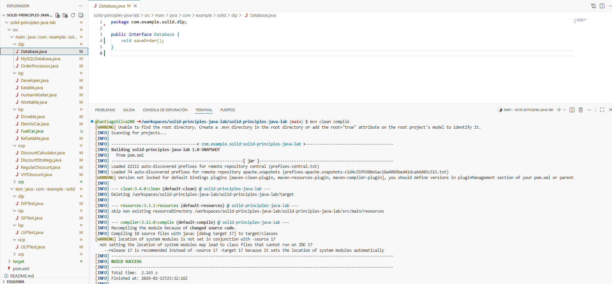

# Laboratorio Principios SOLID en Java

## Realizado por 

- Santiago Silva

## Descripción
En este laboratorio se refactorizó código Java aplicando los cinco principios SOLID.  
El objetivo fue mejorar la mantenibilidad, extensibilidad y desacoplamiento del sistema.

Cada principio fue implementado y validado mediante pruebas unitarias. 

## Principios Aplicados

### 1. SRP — Single Responsibility Principle
Se separaron responsabilidades de la clase `Invoice` en diferentes clases:

- `Invoice` → solo contiene los datos
- `InvoiceCalculator` → calcula el total
- `InvoicePrinter` → imprime la factura
- `InvoiceRepository` → guarda en base de datos

De esta forma, ahora cada clase tiene una única responsabilidad.

**Patrón relacionado:** Separation of Concerns / Service Layer

### 2. OCP — Open/Closed Principle
La clase `DiscountCalculator` dependía de condicionales por tipo de cliente.

Se implementó una estrategia:

- `DiscountStrategy` (interfaz)
- `RegularDiscount`
- `VipDiscount`
- `DiscountCalculator`

Ahora se pueden agregar descuentos sin modificar código existente.

**Patrón aplicado:** Strategy Pattern

### 3. LSP — Liskov Substitution Principle

Se separaron comportamientos:

- `Drivable`
- `Refuelable`
- `FuelCar`
- `ElectricCar`

Ahora cualquier tipo de carro puede sustituirse sin romper el sistema.

**Patrón relacionado:** Interface-based design

### 4. ISP — Interface Segregation Principle
La interfaz `Worker` obligaba a implementar `eat()` innecesariamente.

Se dividió en:

- `Workable`
- `Eatable`

Clases:
- `Developer`
- `HumanWorker`

Cada clase implementa solo lo que necesita.

**Patrón relacionado:** Role Interfaces

### 5. DIP — Dependency Inversion Principle
`OrderProcessor` dependía directamente de `MySQLDatabase`.

Se creó una abstracción:

- `Database` (interfaz)
- `MySQLDatabase`
- `OrderProcessor` recibe la dependencia por constructor

El sistema ahora está desacoplado de la base de datos.

**Patrón aplicado:** Dependency Injection

---

## Pruebas Unitarias
Para cada principio se crearon pruebas unitarias verificando:

- comportamiento correcto
- ausencia de excepciones
- correcto desacoplamiento

## Entorno en CodeSpace y pruebas

## Conclusión
La aplicación de los principios SOLID en este laboratorio o en un entorno organizacion permite:

- código más mantenible
- mayor facilidad para extender funcionalidades
- menor acoplamiento entre clases
- mayor facilidad de pruebas

Esto demuestra cómo el diseño orientado a objetos mejora la calidad del software desde etapas tempranas del desarrollo.
